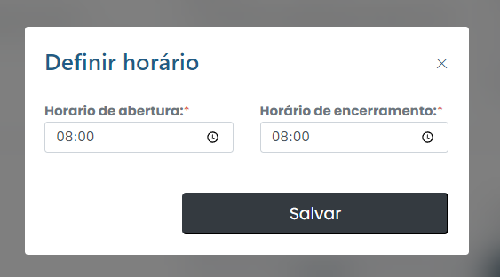

# définir le calendrier

Comment définir un horaire ?&#x20;

Pour définir une heure, cliquez simplement sur l'onglet Définir les heures dans le menu.

<figure><figcaption></figcaption></figure>

Configurez ensuite les informations nécessaires et cliquez sur "Enregistrer". Enregistrez les modifications et confirmez l'heure.
