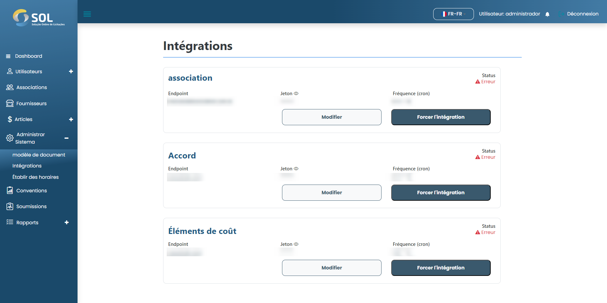

# Intégrations

Dans l'onglet "Intégration", accessible via le menu principal en haut de la page, vous pouvez voir une liste de toutes les intégrations dans le système, modifier leurs informations et forcer l'intégration.

<figure><figcaption></figcaption></figure>
