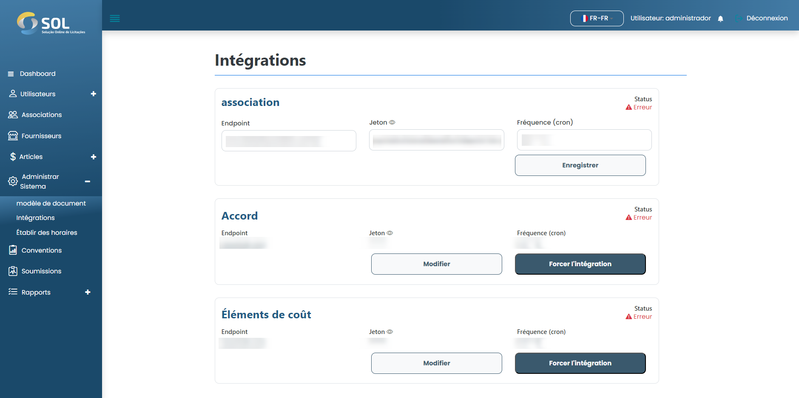

# Modifier l'intégration

## Comment modifier une intégration ?&#x20;

Pour modifier une intégration, cliquez simplement sur la modification disponible à côté du nom de l'intégration dans la liste de l'onglet "Intégrations".

<figure><figcaption></figcaption></figure>
