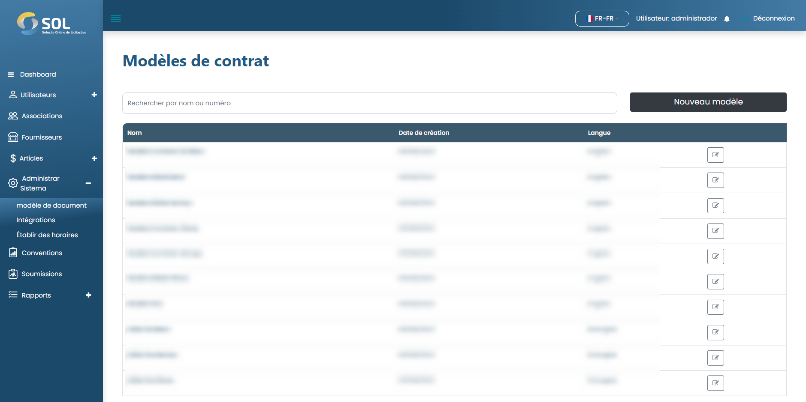

# Modèle de document

Dans l'onglet "Modèles de documents", accessible via le menu principal en haut de la page, il est possible de visualiser une liste de tous les modèles de documents enregistrés dans le système, de modifier leurs informations.

<figure><figcaption></figcaption></figure>
