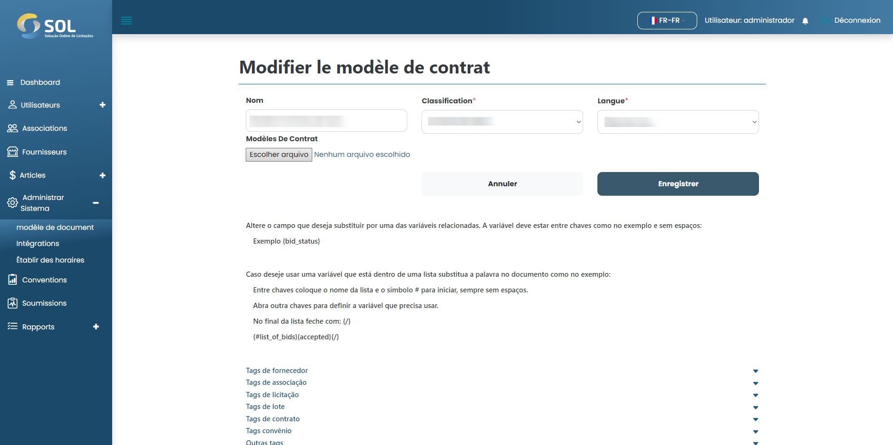

# Modèle de mise à jour

## Comment mettre à jour le modèle ?&#x20;

Pour éditer les informations d'un modèle enregistré, il suffit de cliquer sur l'icône d'édition (crayon) disponible à côté du nom des modèles dans la liste de l'onglet "modèles".

<figure><figcaption></figcaption></figure>
