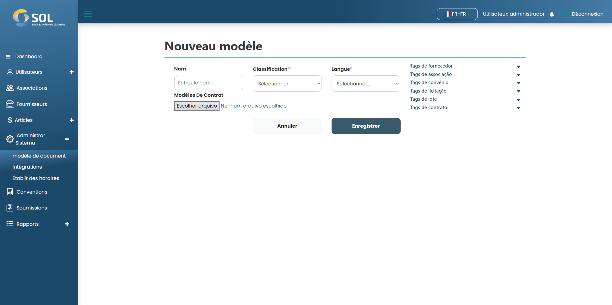

# Nouveau modèle

## Comment ajouter un nouveau modèle ?&#x20;

Pour ajouter un modèle au système, cliquez simplement sur le bouton "Nouveau modèle". Remplissez ensuite les champs obligatoires.

<figure><figcaption></figcaption></figure>
