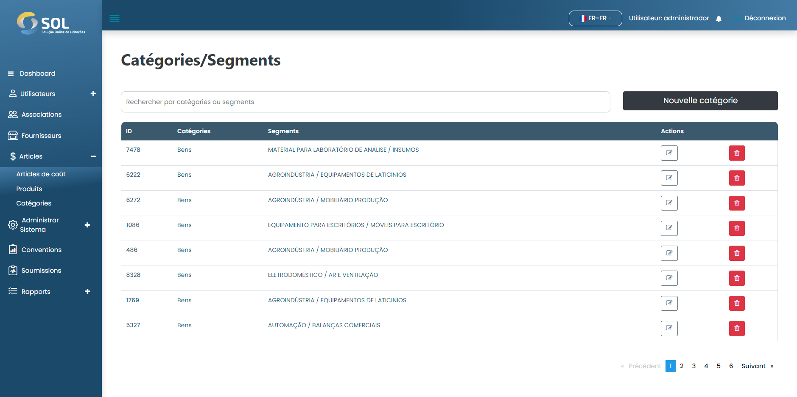

# Catégories

Dans l'onglet "Catégories", accessible via le menu principal en haut de la page, vous pouvez voir une liste de toutes les catégories enregistrées dans le système, voir des détails à leur sujet, modifier des informations, supprimer ou ajouter une nouvelle catégorie.

<figure><figcaption></figcaption></figure>
