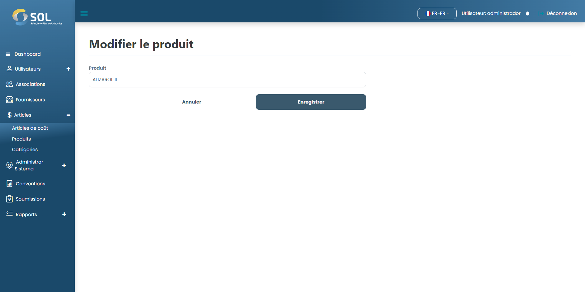

# modifier la catégorie

## Comment modifier une catégorie enregistrée ?&#x20;

Pour modifier les informations d'une catégorie enregistrée, cliquez simplement sur l'icône d'édition (crayon) disponible à côté du nom de la catégorie dans la liste disponible.

<figure><figcaption></figcaption></figure>

Modifiez ensuite les informations selon vos besoins et cliquez sur Enregistrer. Les modifications seront enregistrées et la catégorie sera mise à jour.
