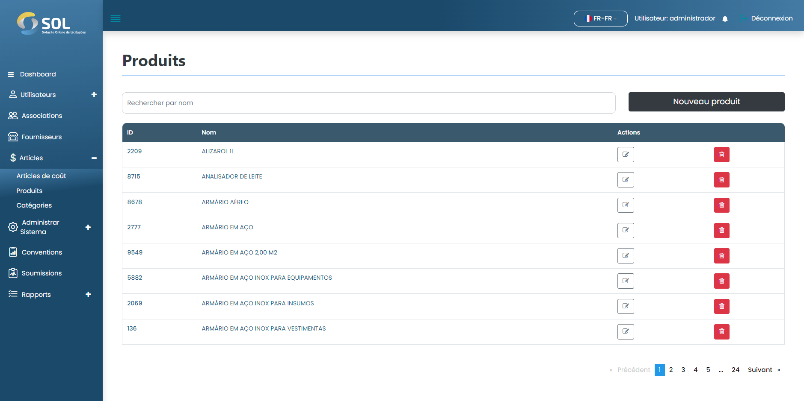

# Des produits

Dans l'onglet "Produits", accessible via le menu principal en haut de la page, vous pouvez voir une liste de tous les produits enregistrés dans le système, voir des détails à leur sujet, modifier des informations, supprimer ou ajouter un nouveau produit.

<figure><figcaption></figcaption></figure>
