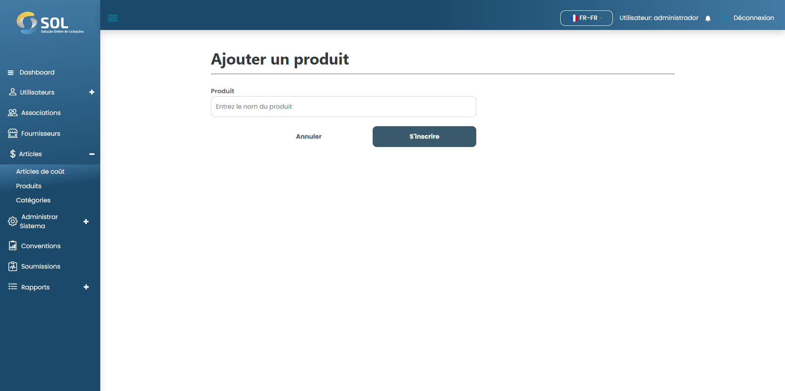

# Ajouter un produit

## Comment ajouter un nouveau produit ?&#x20;

Pour ajouter un nouveau produit au système, cliquez simplement sur le bouton Nouveau produit. Ensuite, remplissez simplement le champ demandé.

<figure><figcaption></figcaption></figure>

Après avoir rempli tous les champs, cliquez simplement sur S'inscrire.
