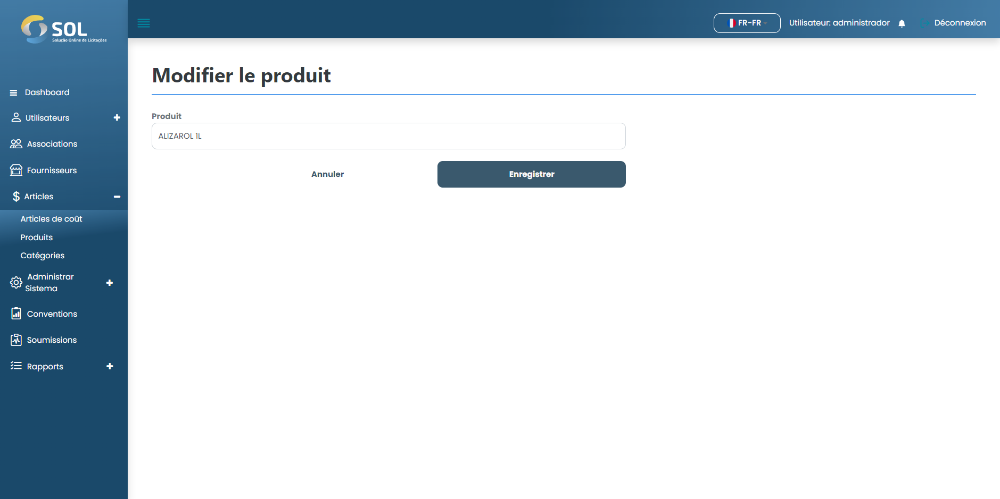

# modifier le produit

## Comment modifier un produit ?&#x20;

Pour modifier les informations d'un produit enregistré, il suffit de cliquer sur l'icône de modification (crayon) disponible à côté du nom du produit dans la liste disponible dans l'onglet "Produits".

<figure><figcaption></figcaption></figure>

Modifiez ensuite les informations selon vos besoins et cliquez sur Enregistrer. Les modifications seront enregistrées et le produit sera mis à jour.
