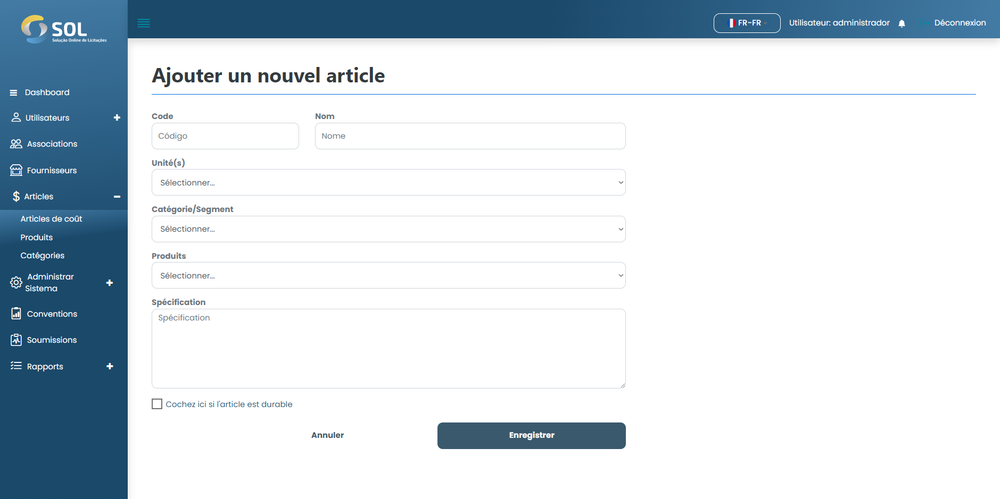

# Ajouter un item

### Comment ajouter un nouvel élément de coût ?

Pour ajouter un nouvel élément de coût au système, cliquez simplement sur le bouton Nouvel élément. Ensuite, remplissez simplement les champs obligatoires.

<figure><figcaption></figcaption></figure>

Après avoir rempli tous les champs, cliquez simplement sur Créer un élément.
