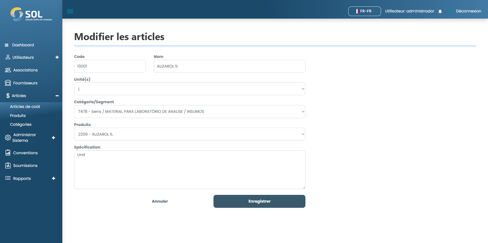

# Modifier l'article

### Comment modifier un élément enregistré?

Pour modifier les informations sur un élément de coût enregistré, il suffit de cliquer sur l'icône d'édition (crayon) à côté du nom de l'élément dans la liste disponible sur l'onglet "Éléments de coût".

<figure><figcaption></figcaption></figure>

Modifiez ensuite les informations selon vos besoins et cliquez sur Enregistrer. Les modifications seront enregistrées et l'élément sera mis à jour.
