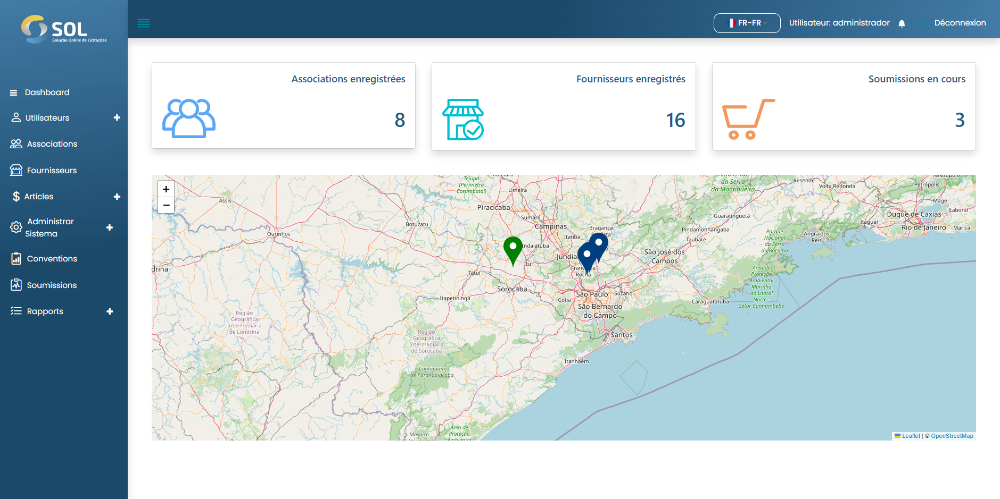

# Dashboard


Lorsque vous accédez à la plate-forme SOL, vous êtes dirigé vers le panneau initial du système (tableau de bord).


<figure><figcaption></figcaption></figure>

Sur cet écran, vous verrez les onglets disponibles dans le menu principal :

* Tableau de bord&#x20;
* Utilisateurs&#x20;
  * Association&#x20;
  * Fournisseurs&#x20;
  * Administration&#x20;
* Les associations&#x20;
* Fournisseurs&#x20;
* Articles&#x20;
  * éléments de coût&#x20;
  * Des produits&#x20;
  * Catégories&#x20;
* Administrer le système&#x20;
  * Modèles de documents&#x20;
  * Intégrations&#x20;
  * établir des horaires&#x20;
* les accords&#x20;
* Enchères&#x20;
* Rapports
  * Enchères&#x20;
  * Contrats&#x20;
  * rapports généraux&#x20;
  * Rapports générés

De plus, vous avez accès à votre profil et aux notifications système – représentées respectivement par les icônes de personne et de cloche – en plus de la carte, avec l'indication des fournisseurs avec des points verts et des associations avec des points bleus. Au-dessus de la carte, on distingue trois zones, le nombre d'associations et de fournisseurs inscrits sur la plateforme et le nombre d'appels d'offres en cours sont répertoriés.

Sur la carte, il est possible de cliquer sur les fournisseurs et associations inscrits. En cliquant sur un point Fournisseur, vous êtes dirigé vers un nouvel écran avec leurs informations respectives.
