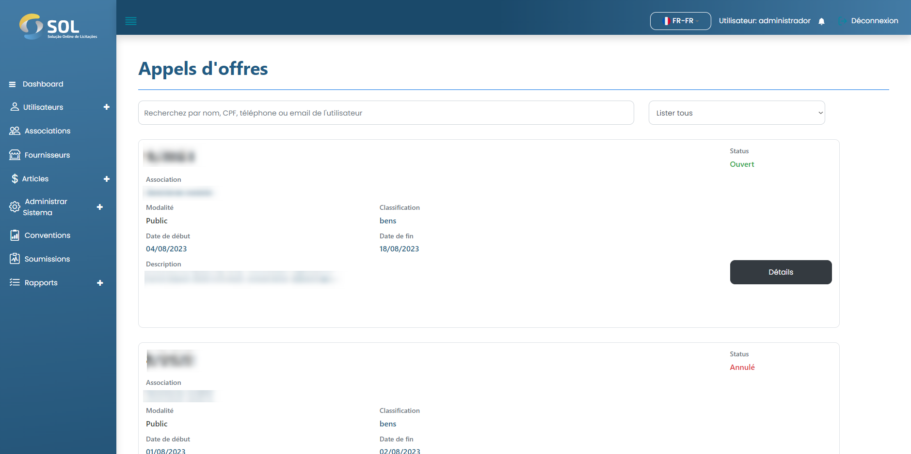
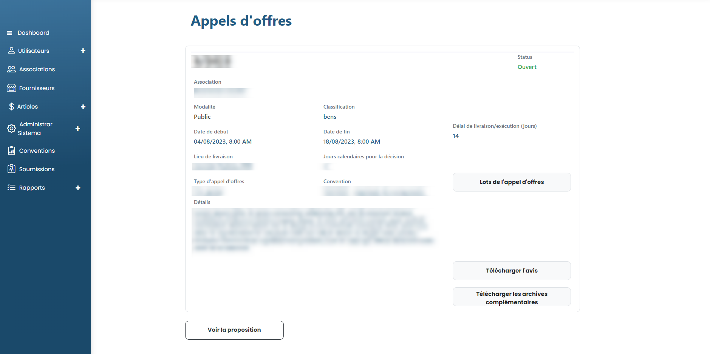

# Enchères

Dans l'onglet « Appels d'offres », accessible via le menu principal en haut de la page, vous pouvez voir une liste de tous les appels d'offres enregistrés dans le système, même ceux déjà complétés.

<figure><figcaption></figcaption></figure>

### Comment afficher les détails d'une enchère ?

Pour accéder aux informations complètes sur une offre, il suffit de cliquer sur le bouton Détail disponible dans le cadre de l'offre.


L'Administrateur est autorisé à effectuer des actions telles que la publication de l'offre et l'approbation ou le rejet du choix entre les propositions faites par l'Association. En règle générale, il n'effectue aucune de ces actions, car ce sont des fonctions du réviseur qu'il désigne pour chaque accord. Par conséquent, dans le cadre de tous les éléments liés aux offres, ce manuel fera référence au profil de l'examinateur.


<figure><figcaption></figcaption></figure>
