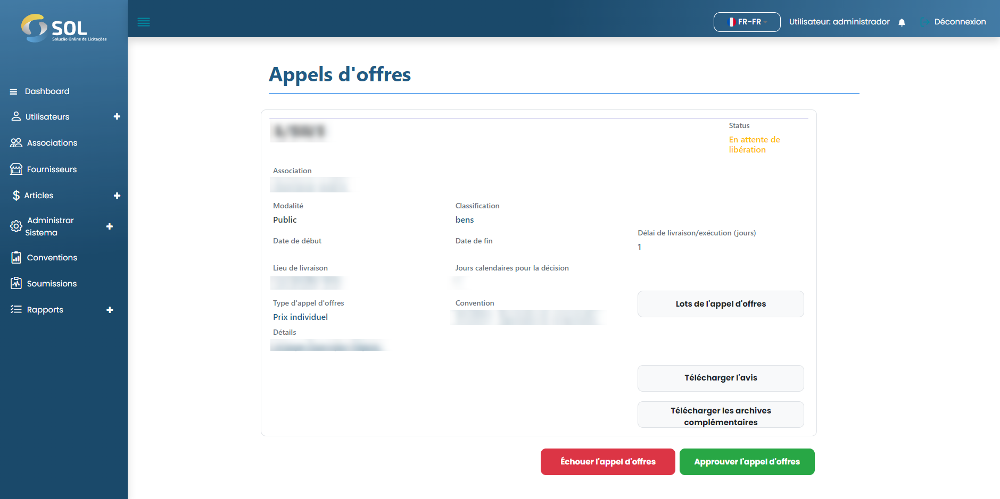
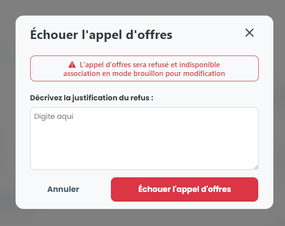

# Libérer/rejeter l'offre

### Comment libérer ou refuser une enchère?

Lorsque vous accédez aux détails d'une offre dont le statut est "En attente de publication", vous pouvez cliquer sur Publier l'offre ou Refuser l'offre.

<figure><figcaption></figcaption></figure>

Si vous avez choisi de refuser l'offre, vous devez remplir et décrire la raison du refus.

<figure><figcaption></figcaption></figure>

Après avoir rempli la justification, cliquez simplement sur Refuser l'enchère.
