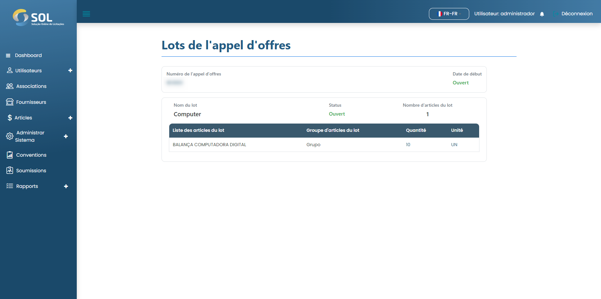

# Lots d'enchères

Pour vérifier quels articles sont enchéris et en quelle quantité, cliquez simplement sur Lots d'enchères. Une page avec les informations est ouverte uniquement pour consultation et si le lot a déjà reçu des propositions de Fournisseurs.

<figure><figcaption></figcaption></figure>

### Comment consulter les propositions faites?

Vous pouvez cliquer sur le bouton Afficher les propositions. Une liste de toutes les propositions s'affichera.


En cliquant sur le bouton Liste des Propositions, disponible uniquement pour les offres "Prix Global", vous avez accès à toutes les propositions reçues dans cette offre.


Tant que l'appel d'offres est ouvert, aucune action n'est possible pour l'examinateur. Lorsque l'appel d'offres est clos, le statut passe à "En cours d'examen" et l'Association choisit l'une des propositions. Lorsque le choix est fait, le réviseur recevra une notification.

Après cela, vous devez à nouveau accéder à la page d'enchères. Cette fois, le système montrera quelle est la meilleure proposition (avec la valeur la plus basse) et laquelle a été choisie par l'Association.
