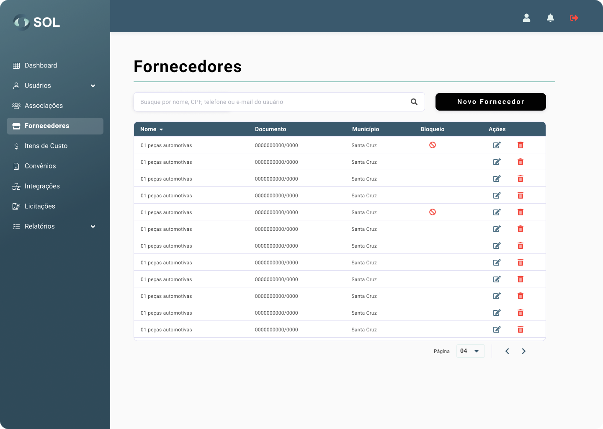

# Fournisseurs

Dans l'onglet "Fournisseurs", accessible via le menu principal en haut de la page, vous pouvez voir une liste de tous les fournisseurs enregistrés dans le système, voir des détails à leur sujet, modifier les informations, supprimer un fournisseur ou en ajouter un nouveau .

<figure><figcaption></figcaption></figure>

### Comment consulter les coordonnées d'un fournisseur ?

En cliquant sur le nom d'un fournisseur, vous avez accès à la page avec des données générales, y compris les catégories auxquelles il peut fournir des produits.

<figure><figcaption></figcaption></figure>
