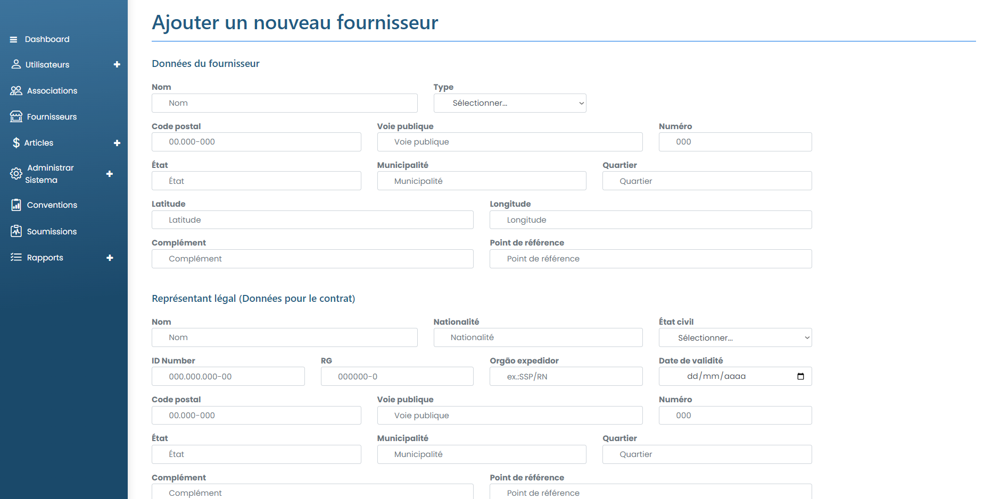

# Ajouter un fournisseur

### Comment ajouter un nouveau fournisseur ?

Pour ajouter un nouveau fournisseur au système, cliquez simplement sur le bouton Nouveau fournisseur. Ensuite, remplissez simplement les champs obligatoires.

<figure><figcaption></figcaption></figure>


Pour remplir le champ "Catégorie et segments", cliquez dessus et sélectionnez l'option correspondant aux produits, travaux ou services que le Fournisseur peut proposer. Pour ajouter plusieurs segments et catégories, cliquez simplement sur + Ajouter. Avec cela, le système fournira un nouveau champ dans lequel vous pourrez sélectionner l'option la plus appropriée pour ce fournisseur.


Après avoir rempli tous les champs, cliquez simplement sur Créer un fournisseur.
