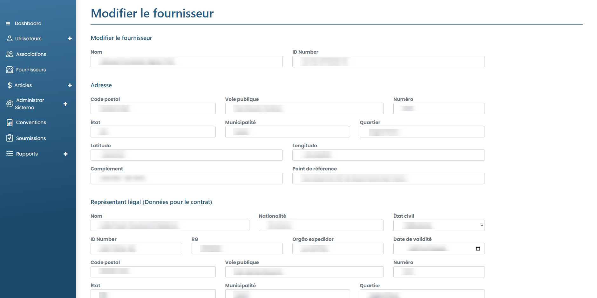

# Modifier le fournisseur

### Como editar um fornecedor cadastrado?

Pour modifier les informations d'un fournisseur enregistré, il suffit de cliquer sur l'icône d'édition (crayon) disponible à côté du nom du fournisseur dans la liste disponible dans l'onglet "Fournisseurs".

<figure><figcaption></figcaption></figure>

Modifiez ensuite les informations selon vos besoins et cliquez sur Enregistrer. Les modifications seront enregistrées et le fournisseur sera mis à jour.
