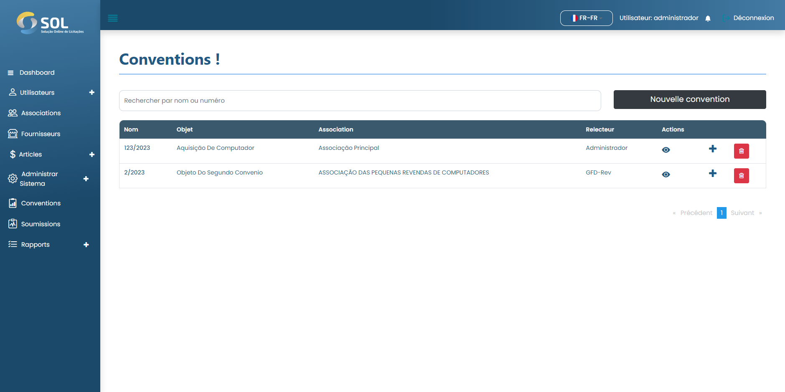
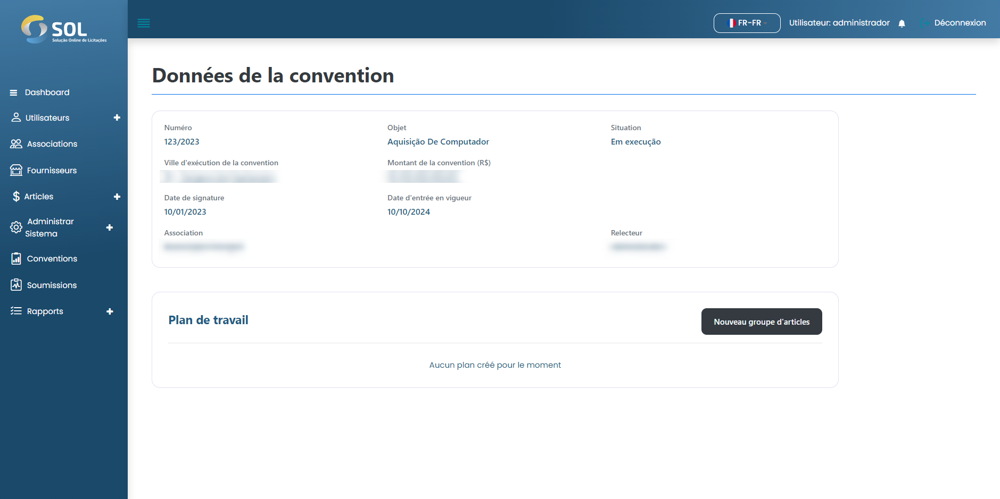

# les accords

Dans l'onglet "Accords", accessible via le menu principal en haut de la page, vous pouvez voir une liste de tous les accords enregistrés dans le système, voir des détails à leur sujet, modifier des informations, supprimer un accord ou ajouter un nouvel accord.


Il est à noter que si les données de l'accord ont été importées depuis une intégration, il n'est pas possible de les modifier, quel que soit votre profil d'administrateur.


<figure><figcaption></figcaption></figure>

Comment afficher les détails d'un accord ?Ao clicar sobre o nome de um Convênio, você tem acesso à página com os dados gerais.


Le "plan de travail" est l'endroit où les éléments à acquérir dans cet accord doivent être spécifiés. Pour accéder à la page avec ces éléments, il suffit de cliquer sur le lien du plan de travail.


<figure><figcaption></figcaption></figure>
