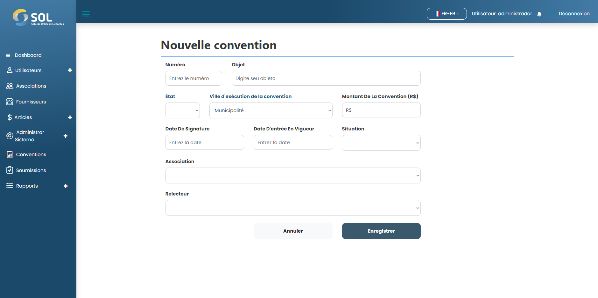

# Ajouter une alliance

### Comment ajouter un nouveau contrat ?

Pour ajouter un nouvel accord au système, cliquez simplement sur le bouton Nouvel accord.&#x20;

Dans le champ « Réviseur », vous devez définir quel profil d'administrateur de réviseur sera responsable des offres et des contrats liés à ce nouvel accord.

<figure><figcaption></figcaption></figure>

Après avoir rempli tous les champs, cliquez simplement sur Créer un accord.
