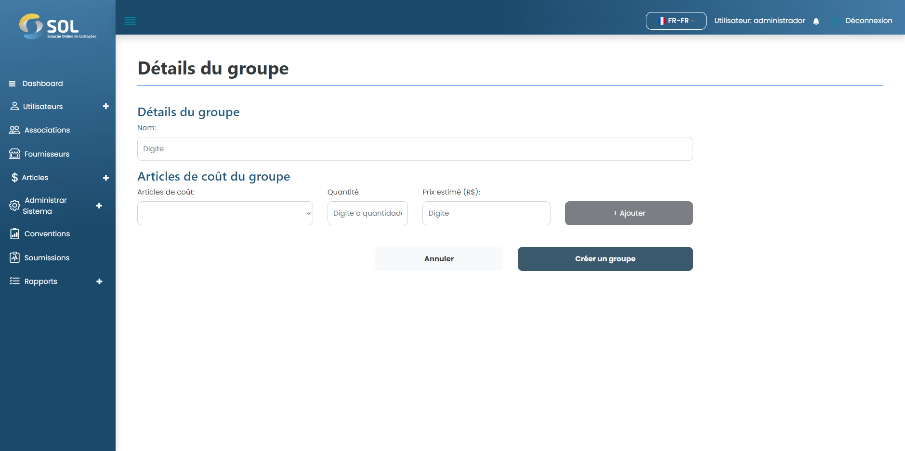

# Ajouter un groupe

### Comment ajouter un nouveau groupe ?

Pour ajouter un nouveau groupe au plan de travail, il suffit de cliquer sur le bouton Nouveau groupe d'éléments, puis de renseigner toutes les données demandées.

Chaque groupe peut contenir plusieurs éléments. Pour les ajouter, tapez simplement les trois premières lettres de l'article en question dans le champ "Article de coût" et le système affichera une liste avec tous les articles qui contiennent ces lettres.

Ensuite, sélectionnez simplement l'article que vous voulez, spécifiez la quantité, le coût estimé et cliquez sur Ajouter. Répétez cette opération autant de fois que nécessaire pour compléter votre nouveau groupe d'éléments.

<figure><figcaption></figcaption></figure>

Après avoir rempli tous les champs, cliquez simplement sur Créer un groupe.
