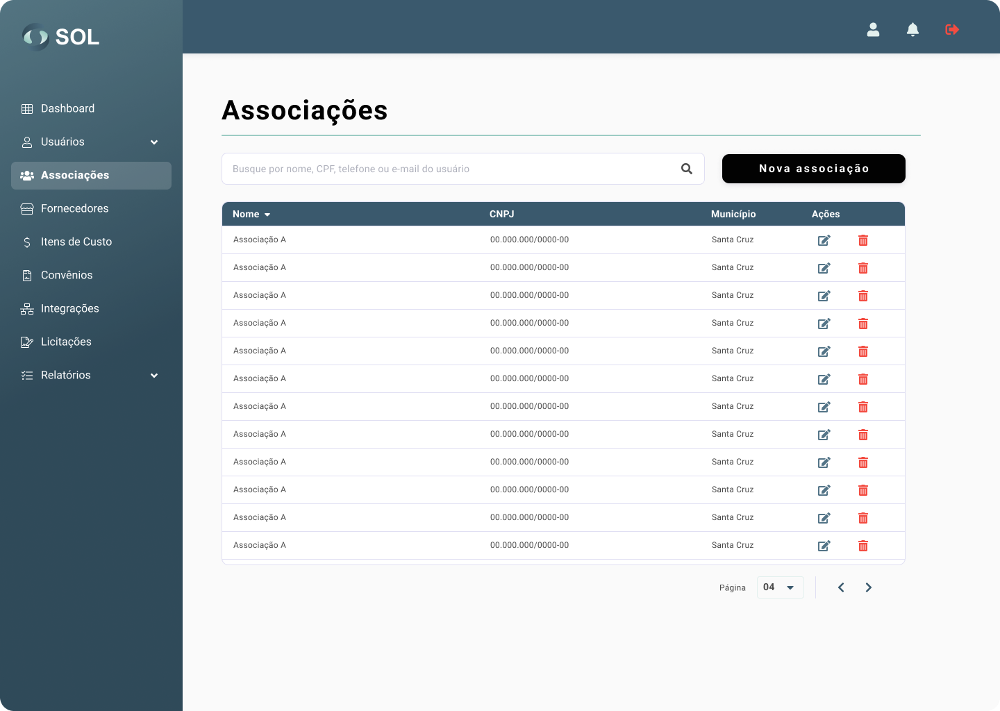

# Les associations

Dans l'onglet "Associations", accessible via le menu principal en haut de la page, vous pouvez voir une liste de toutes les associations enregistrées dans le système, voir les détails à leur sujet, modifier les informations, supprimer une association ou ajouter une nouvelle association .

<figure><figcaption></figcaption></figure>


Il convient de noter que si les données d'adhésion ont été importées à partir d'une intégration, il n'est pas possible de les modifier, quel que soit votre profil d'administrateur.


### Comment afficher les détails de l'adhésion ?

En cliquant sur le nom d'une association, vous avez accès à la page avec ses données générales, y compris les accords auxquels elle est actuellement liée et quel examinateur est responsable de ses offres et contrats.

<figure><figcaption></figcaption></figure>
