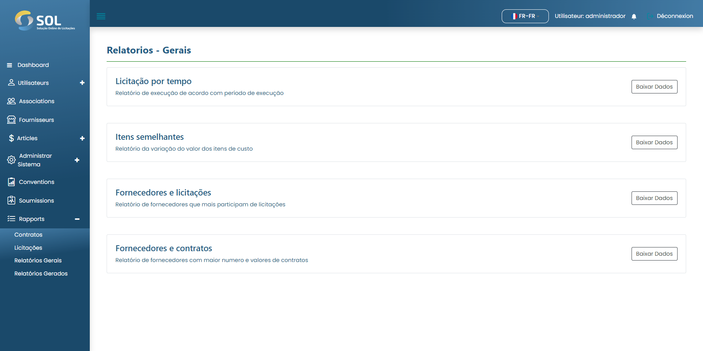

# Rapports généraux

Dans l'onglet "Rapports généraux", accessible via le menu principal en haut de la page, il est possible de visualiser les rapports du système et de les télécharger.

<figure><figcaption></figcaption></figure>
