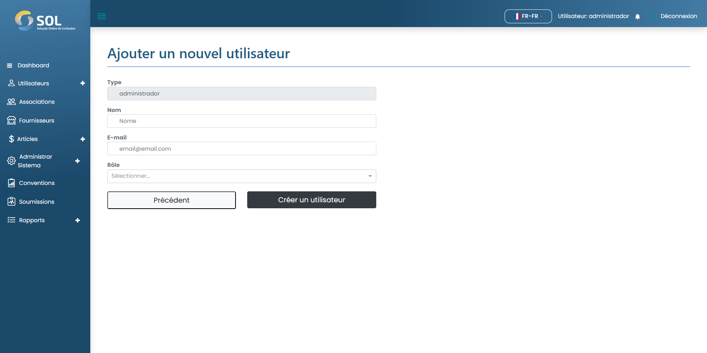

# Enregistrer l'utilisateur

### Comment enregistrer un nouvel utilisateur ?

Pour ajouter un utilisateur d'adhésion, cliquez simplement sur le bouton Nouvel utilisateur et remplissez les champs existants sur la page qui s'ouvrira par la suite.


Dans le champ "Rôle (type)", vous devez sélectionner le type de profil que l'utilisateur aura, ce qui a un impact sur les autorisations dont l'utilisateur disposera au sein du système.


<figure><figcaption></figcaption></figure>

Après avoir rempli tous les champs, cliquez simplement sur Créer un utilisateur.
