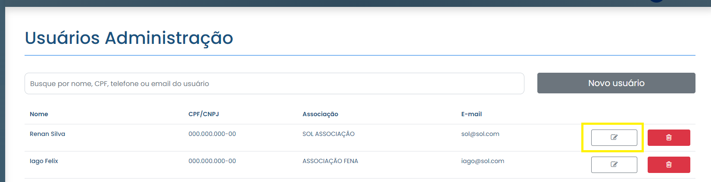

# Modifier l'utilisateur

### Comment modifier un utilisateur enregistré ?

Pour modifier les informations d'un utilisateur enregistré, il suffit de cliquer sur l'icône d'édition (crayon) disponible à côté du nom du profil dans la liste disponible dans l'onglet "Utilisateurs".

<figure><figcaption></figcaption></figure>

Modifiez ensuite les informations selon vos besoins et cliquez sur Enregistrer. Les modifications seront enregistrées et le profil sera mis à jour dans la liste des utilisateurs.

<figure><figcaption></figcaption></figure>
