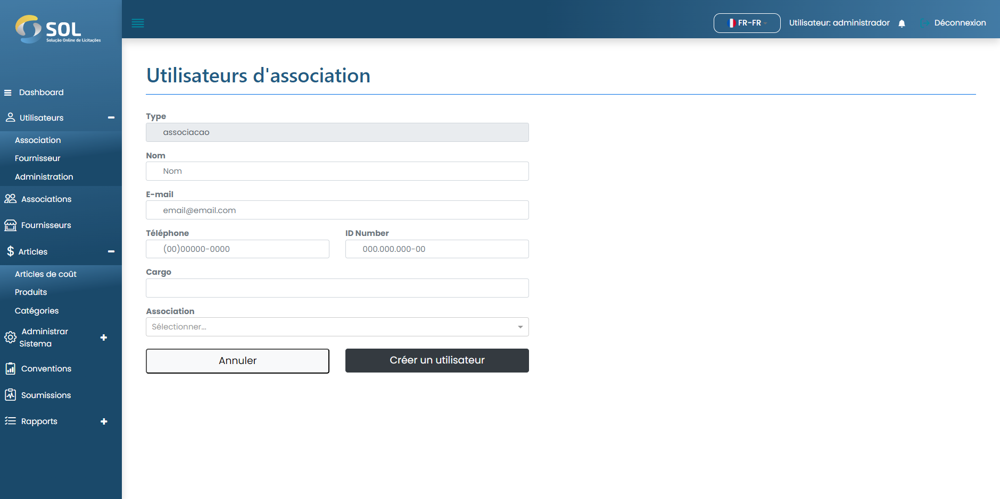

# Enregistrer l'utilisateur

### Comment enregistrer un nouvel utilisateur ?

Pour ajouter un utilisateur d'adhésion, cliquez simplement sur le bouton Nouvel utilisateur et remplissez les champs existants sur la page qui s'ouvrira par la suite.


Dans le champ "Association", vous devez écrire au moins les trois premières lettres du nom d'une Association. Avec cela, le système affichera une liste avec toutes les associations qui contiennent ces lettres. Le même processus doit être répété pour remplir le champ "Position".


<figure><figcaption></figcaption></figure>

Après avoir rempli tous les champs, cliquez simplement sur Créer un utilisateur.
