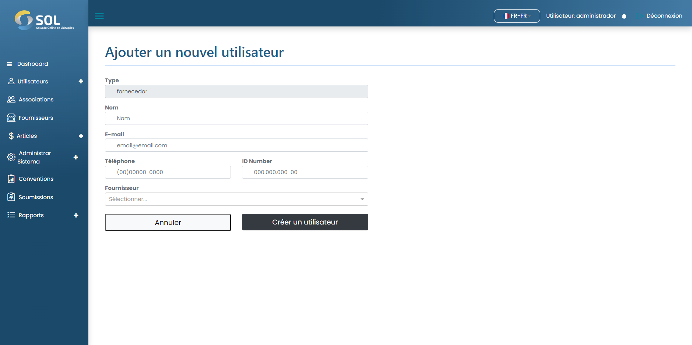

# Enregistrer l'utilisateur

### Comment enregistrer un nouvel utilisateur ?

Pour ajouter un utilisateur d'adhésion, cliquez simplement sur le bouton Nouvel utilisateur et remplissez les champs existants sur la page qui s'ouvrira par la suite.


Dans le champ "Fournisseur", vous devez écrire au moins les trois premières lettres du nom d'un fournisseur. Avec cela, le système affichera une liste de tous les fournisseurs enregistrés qui contiennent ces lettres.


<figure><figcaption></figcaption></figure>

Après avoir rempli tous les champs, cliquez simplement sur Créer un utilisateur.
