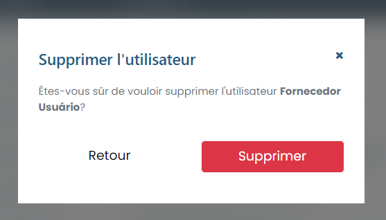

# Supprimer l'utilisateur

### Comment supprimer un utilisateur ?

Pour supprimer un utilisateur enregistré, il suffit de cliquer sur l'icône de suppression (poubelle) disponible à côté du nom du profil dans la liste disponible dans l'onglet "Utilisateurs".

Ensuite, le système affichera un modal de confirmation, cliquez simplement sur Supprimer et cet utilisateur sera supprimé du système.

<figure><figcaption></figcaption></figure>
