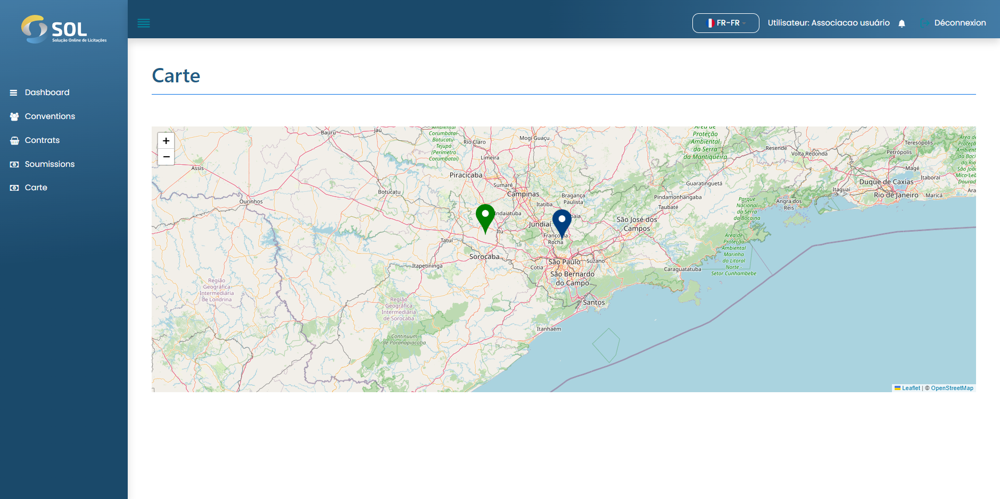

# Carte

L'écran "Cartes" est accessible via son onglet dans le menu principal du système. Il indique les emplacements des fournisseurs enregistrés dans le système (points en bleu), en plus de leur propre emplacement (point en vert). En cliquant sur l'un d'eux, le nom s'affiche.

<figure><figcaption></figcaption></figure>
