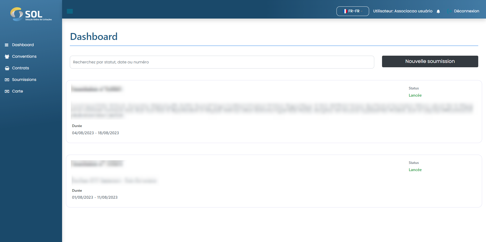

# Dashboard


Lorsque vous accédez à la plate-forme SOL, vous êtes dirigé vers le panneau initial du système (tableau de bord).


<figure><figcaption></figcaption></figure>

Sur cet écran d'accueil, vous verrez l'aperçu de votre profil : vos informations personnelles et les dernières offres ouvertes. De plus, sur la page d'accueil, vous pouvez créer une offre en cliquant sur le bouton Nouvelle offre.


Pour chaque appel d'offres affiché, nous avons accès aux dix derniers appels d'offres ouverts et pouvons visualiser les informations clés sur les documents. Sont-ils:

* Le titre de l'appel d'offres ;
* La situation dans laquelle il se trouve (statut);
* Période de temps, il restera ouvert.

Pour afficher toutes les offres en plus des dernières offres, cliquez simplement sur le bouton Parcourir les offres.


De plus, vous avez accès à votre profil et aux notifications système - représentés respectivement par les icônes de personne et de cloche.


#### Examen de l'appel d'offres

Après avoir créé l'enchère, le statut passe à "En attente de publication", comme indiqué dans l'image ci-dessous. Ensuite, le réviseur de l'accord vérifiera si les données saisies dans l'enchère sont correctes, ainsi que les informations sur les lots et les articles.



#### Appel d'offres publié

Si toutes les données d'offre sont correctes, l'examinateur les publiera. À ce moment, le statut de l'enchère sera "Libéré". Le profil de l'association recevra une notification lorsque le changement de statut se produira.

Lorsque l'offre est publiée, son avis public est disponible pour consultation et téléchargement. Pour y accéder, il suffit de cliquer sur le bouton "Télécharger l'avis public" disponible sur le même écran présenté ci-dessus.



#### appel d'offres ouvert

Dès l'arrivée de la date de début des enchères, définie par l'Association lors de sa création, les enchères passeront au statut "Ouvert". Ce n'est qu'à partir de la « date de début » que les fournisseurs pourront envoyer des propositions pour l'appel d'offres.



#### Offre rejetée

Si des informations sur l'enchère doivent être corrigées, le réviseur de l'accord la refusera. Chaque fois que cela se produit, il doit préciser le motif du refus. Le statut de l'enchère revient automatiquement à "En Brouillon" et un message s'affiche à l'Association.


L'Association sera toujours informée de l'évolution de la situation des appels d'offres créés. Les modifications sont affichées dans l'onglet "Notifications", accessible depuis le menu principal.
