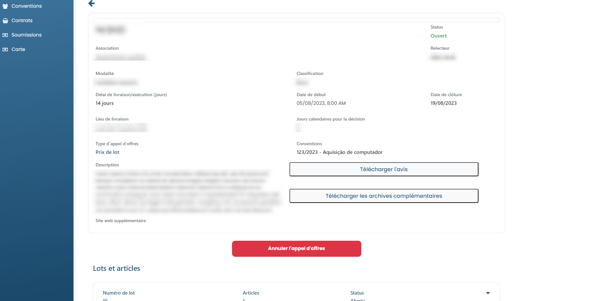

# Annuler l'enchère

### Comment annuler une enchère ?

L'Association peut demander l'annulation d'un appel d'offres à tout moment, tant qu'il est déjà ouvert. Pour ce faire, accédez simplement à l'enchère et cliquez sur le bouton Annuler l'enchère.

Ensuite, vous devrez renseigner le motif de la demande d'annulation. Après avoir fourni la raison, cliquez sur Soumettre la demande d'annulation.

<figure><figcaption></figcaption></figure>


L'Examinateur de l'Accord pourra accepter la demande d'annulation ou la refuser. S'il accepte, le statut de l'enchère sera "Annulé" ; s'il n'accepte pas, la situation d'enchères restera la même.

