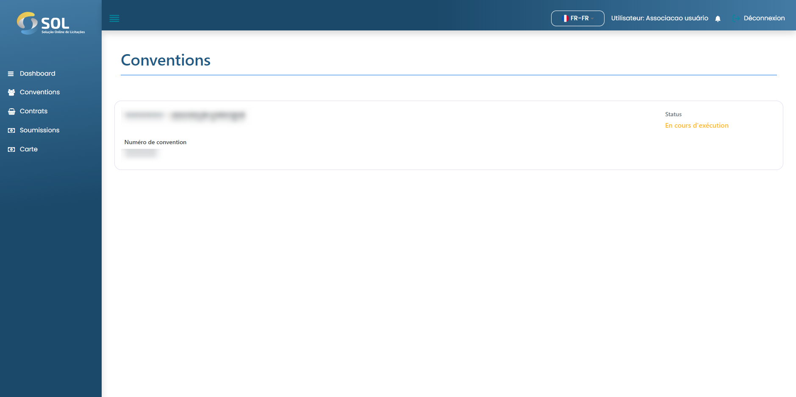

# Les accords

En cliquant sur l'onglet « Ententes », vous êtes dirigé vers l'écran principal des ententes du Système. La page donne un aperçu des accords formés jusqu'à présent et de la situation dans laquelle ils se trouvent.

<figure><figcaption></figcaption></figure>

### Comment afficher les détails d'un accord ?

Si vous souhaitez accéder aux détails d'un accord, il vous suffit de cliquer sur celui que vous souhaitez consulter. Une fois sur la page d'un accord spécifique, intitulé « Accord », vous accédez à ses particularités. Les informations sont configurées lors de la création d'un accord.

<figure><figcaption></figcaption></figure>
