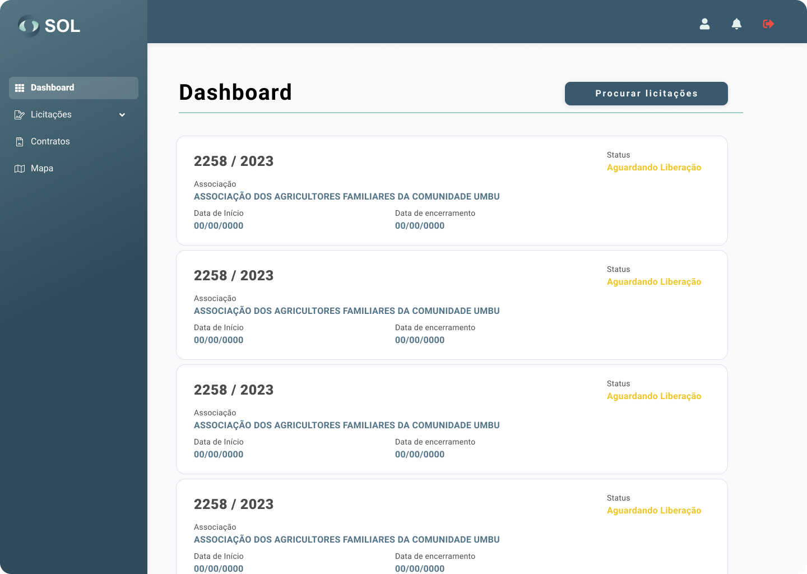

# Dashboard

<figure><figcaption></figcaption></figure>


Lorsque vous accédez à la plate-forme SOL, vous êtes dirigé vers le panneau initial du système (tableau de bord).


Sur cet écran d'accueil, vous verrez l'aperçu de votre profil : vos informations personnelles et les dernières offres ouvertes – auxquelles vous participez ou auxquelles vous pouvez participer.


Pour chaque appel d'offres affiché, nous avons accès aux dix derniers appels d'offres ouverts et pouvons visualiser les informations clés sur les documents. Sont-ils:

* Le titre de l'appel d'offres ;
* La situation dans laquelle il se trouve (statut);
* Période de temps, il restera ouvert.

Pour afficher toutes les offres en plus des dernières offres, cliquez simplement sur le bouton Parcourir les offres.


De plus, vous avez accès à votre profil et aux notifications système - représentés respectivement par les icônes de personne et de cloche.
