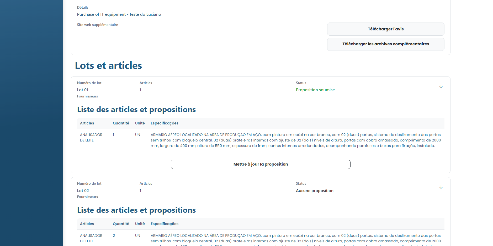

# Mettre à jour la proposition

### Comment mettre à jour une proposition soumise?


Il n'est possible d'éditer la proposition que si l'enchère n'est pas du mode "Invitation fermée".


Le fournisseur peut mettre à jour les valeurs des propositions - faites par lui - pendant que l'appel d'offres est encore ouvert. Pour cela, il vous suffit d'accéder à l'offre en question et de vous rendre dans l'onglet « Lots et objets ». Il vous suffit donc de cliquer sur le lot dont vous souhaitez mettre à jour la proposition, puis de cliquer sur Modifier la proposition.

<figure><figcaption></figcaption></figure>

Une fois cela fait, entrez la nouvelle valeur de la proposition et cliquez sur Enregistrer la proposition. Dans le même temps, il est possible de mettre à jour la valeur du fret.

<figure><figcaption></figcaption></figure>

&#x20;Ensuite, cliquez simplement sur Mettre à jour la proposition.
